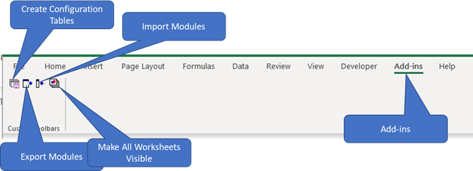
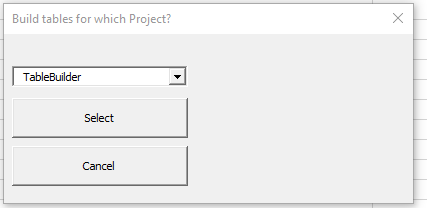
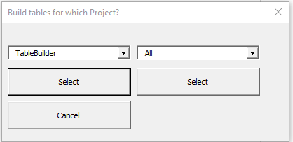

**VBA Code Management**

Performing VBA code management can be challenging. Microsoft doesn’t provide anything except saving the entire workbook. There’s no way to find that one line of code you changed yesterday. It would be helpful if Microsoft provided some way to export all the VBA code from your Excel workbook at once. There’s the one-at-a-time export and import you can do from the VB Editor but that’s pretty cumbersome if you have more than a handful of VBA modules.

I’ve created code handling routines in my `Personal.xlsb` workbook that allow me to export and import entire collections of modules at once. Once your VBA code is in a folder, you can use git or any other change management program to manage your changes.

My `Personal.xlsb` workbook creates a new element in the Excel ribbon called Add-ins (https://github.com/BriargateExcel/AddingVBARibbonElements). Within that ribbon element, `Personal.xlsb` creates 4 buttons:

- Create configuration tables
- Export modules
- Import modules
- Make all worksheets visible. This isn’t one of the code management buttons but I find it useful to make all the worksheets in a workbook visible with one button click.

 

**Create configuration tables** populates three tables in a worksheet called “VBA Make File.” The first table (modules table) lists all the modules in the workbook and groups them into three groups called All, Common, and Built. The groups overlap; a module can belong to more than one group. The second table (paths table) specifies the folder where each module group is stored. The third table (references table) is a list of all the references in this workbook. The import function ensures that all necessary references area properly set.

**Export Modules** reads the module and paths tables and writes the selected modules to the selected folder.

**Import modules** reads the modules and paths tables and imports all the modules from the selected folder.

**How to use create configuration tables:**

- Trust access to the VBA project object module for your workbook: File -> Options -> Trust Center -> Trust Center Settings -> Macro Settings -> check the box. This is necessary to allow VBA to manipulate the code in your workbook.
- Put a copy of my `Personal.xlsb` workbook (from gitlab or github) in your Excel/XLSTART folder
- The next time you open a workbook, you will see the Add-ins option in your ribbon
- Automating these next 2 steps is on the to-do list
- Create a worksheet called VBA Make File
- Create the three tables. The easiest way to do this is to copy the tables from my example file in gitlab or github.
- Press the create configuration tables button. A form will pop up asking you which VBA Project you’re interested in.

- If you have several workbooks open, you can select the right one from the drop down and press select. It’s very important to change the name of each workbook’s VBAProject to a name that’s unique to that workbook. In the VB Editor -> Tools -> Properties and specify a name for your project. If you don’t make the VBA project name unique to each workbook, you will have a dropdown full of VBAProjects and you won’t be able to distinguish which one you want.

- After you select your project a second dropdown will appear so you can select the group of modules you’re interested in. When you’re creating configuration tables, select All.
- The code manager will scan through the modules in your workbook and compare that list against the list of modules in the modules table. The code will ask if you want to add new modules or delete missing modules from the modules table.
- The code manager will then ask you for the folders where you want to store All your modules, your Common modules, and your Built modules. I’ve created several modules that I use in every project; those are the Common modules. I do a lot of automated code generation; that’s where the Built modules go. See the TableBuilder for more details.
- The code manager will scan through the references in your workbook and compare that list against the list of references in the references table. The code will ask if you want to add new references or delete missing references from the references table.
- The code manager will update the three tables and will tell you it was successful.
- You will need to populate the Paths column of the modules table by hand. I always start by putting All in every row of the modules table then add Common or Built to the appropriate rows.

**How to use export modules:**

- Press the export button. A form will pop up asking which VBA project to export.
- After you select the project, a second dropdown will appear so you can select the group of modules you want to export.
- The code manager will export the selected modules to the specified folder where you can run git or your favorite code configuration manager
- The code manager will tell you it was successful.

**How to use import modules:**

- VERY IMPORTANT: save your workbook before importing any modules and confirm things are working before you save over top of the old workbook
- Press the import button. A form will pop up asking which VBA project to import.
- After you select the project, a second dropdown will appear so you can select the group of modules you want to import.
- The code manager will import the selected modules from the specified folder
- The code manager will tell you it was successful
- Limitation: you cannot import into the Personal.xlsb workbook because you cannot import code that replaces the code you are executing.

**Options:**

You are not limited to the three groupings I created (All, Common, and Built). You can create other groupings that work for you. You will have to manually populate the paths table. The second dropdown will contain all your groupings.